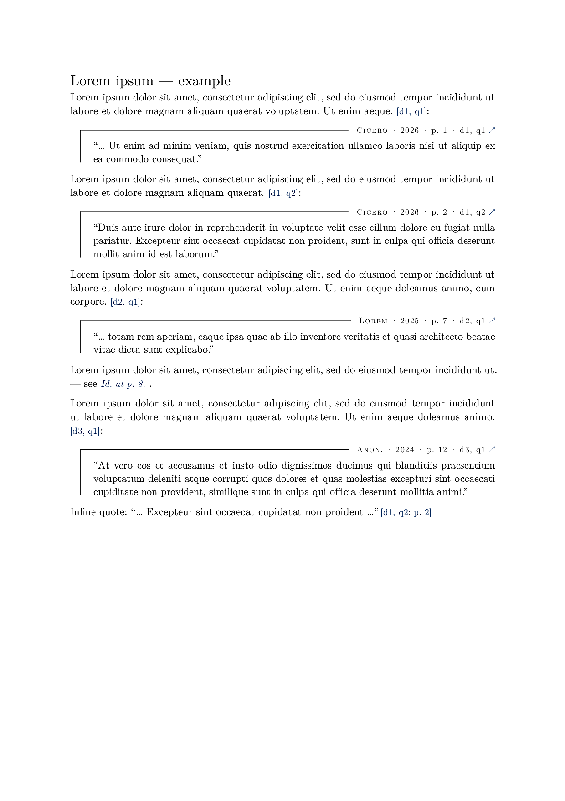

# `labquote`

`labquote` is a Typst package for classical, legal, and scientific quotation. It
renders verbatim quotes, block quotes, bare citations, legal `Id.` back-references,
and a styled, grouped bibliography — all driven from a [Hayagriva](https://github.com/typst/hayagriva)
YAML file with **namespaced keys**, as produced by [`evid`](https://github.com/evidlabel).

The bibliography is Typst-native compatible: the same `refs.yml` also works with
`#bibliography("refs.yml", style: "chicago-author-date")`.



*Verbatim quotes carry their attribution and a clickable `[d, q]` cite; the grouped References page collects each quote under its source.*

## Namespaced keys

`evid` emits keys of the form `<doc>:<slug>`, e.g. `0001:dolor`. Keys sharing a
`<doc>` prefix are grouped as one source in the bibliography:

- `<doc>:main` — document-level metadata (title, author, date, url). Optional.
- `<doc>:<slug>` — an individual quote drawn from that document; its `title`
  field holds the exact quoted text.

Documents are numbered `d1, d2, …` in file order; quotes within a document are
numbered `q1, q2, …`. Inline cites render as `[d2, q1]` and link to the back page.

## Usage

```typst
#import "@preview/labquote:0.1.0": *

#setup(yaml("refs.yml"))            // hayagriva YAML
// or: #setup-bib(read("refs.bib")) // biblatex

#lorem(12) #cite-ref("0001:dolor"):

#blockq("0001:dolor", start: "Ut enim ad minim", end: "commodo consequat.")

Inline: #q("0001:amet", pin: "p. 2")

Legal back-reference to the last cite: #id(pin: "¶ 4").

#bibliography-custom()
```

## Commands

- `setup(data, blockquote-indent: 1em, blockquote-style: "bracket")` — register a Hayagriva YAML dict (from `yaml("refs.yml")`). Call once, near the top. `blockquote-indent` sets the left inset of block quotes from the margin; `blockquote-style` sets their default look (see `blockq` below).
- `setup-bib(src, blockquote-indent: 1em, blockquote-style: "bracket")` — register a biblatex string instead (from `read("refs.bib")`).
- `q(key, ..)` — inline quote. Full entry text by default; slice with `start:`/`end:`; or pass an explicit `[body]`. Optional `pin:`.
- `blockq(key, .., style: …)` — block quote carrying author · year · pin · `[d, q]` · link. The `style:` argument (default from `setup`) picks the frame:
  - `"bracket"` — top hairline + left rule, attribution on the top edge (the default).
  - `"box"` — full border around the quote, attribution top-right.
  - `"fill"` — filled background panel, attribution top-right.
- `cite-ref(key, pin: …)` — bare inline `[d, q]` cite, clickable to the bibliography.
- `id(pin: …)` — legal `Id.`, auto-tracking the most recent cite.
- `bibliography-custom(brief: false)` — styled References back page, grouping quotes under their source and italicising the slices actually quoted in the text. Pass `brief: true` to keep the document (`d`) entries but list the quote (`q`) items as a compact inline row of clickable markers (with pins), without repeating each quote's text.

## Local install

```bash
./local_install.sh install   # copies into the local @preview namespace
./local_install.sh clean      # removes it
```

See `template/main.typ` for a complete worked example.
